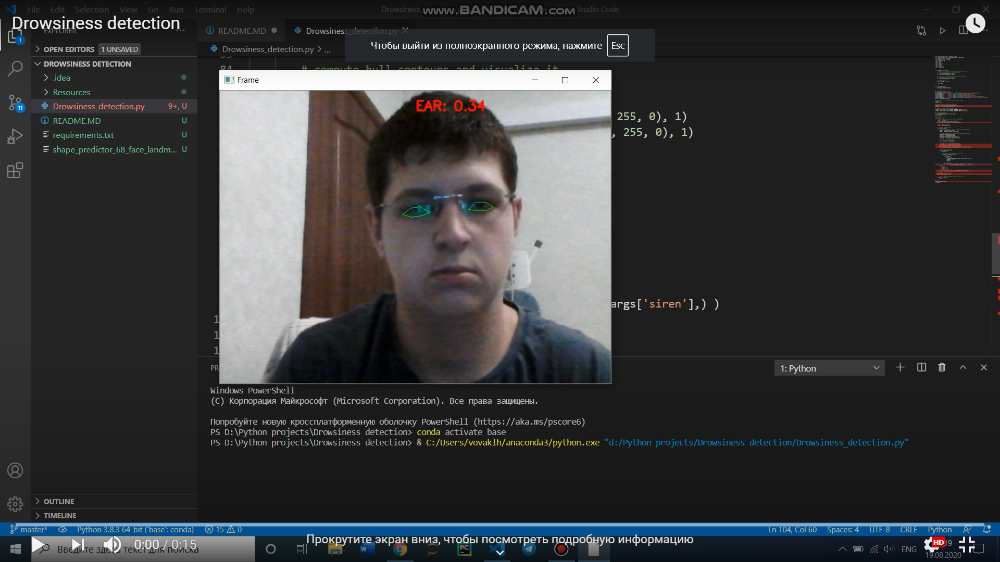

# Description

This application is used to detect drowsinnes. The source code was taken from
[pyimagesearch](https://www.pyimagesearch.com/2017/05/08/drowsiness-detection-opencv/).
We use the deep learning framework **dlib** to detect faces in image and then predict
keypoints (You need to have installed the **Visual Studio** and **C++ tools** to install this library). Next step is to extract eye regions and compute eye aspect ratio.

If the EAR is less than our threshold value for some time we can assume that person starts to fall asleep.
# Using
1. Firstly create folder, open it in IDE or text editor and clone reposytory (or download zip) 
> git clone https://github.com/vovaklh/Drowsiness_detection.git
2. Secondly install needed libraries 
> pip install -r requirements.txt
3. You can use your shape-preictor or own signal 
> python Drowsiness_detection.py --predictor (path_to_your_predictor) --siren (path_to_signal)